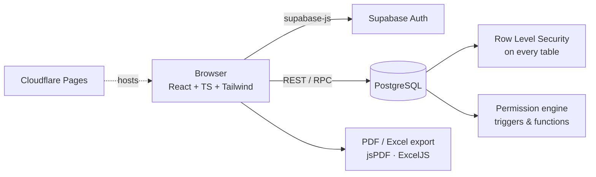

<div align="center">

# 👥 StaffFlow
### Employee Management & HR System

**Attendance · Leaves · Evaluations · Monthly Ranking · Reports — with security enforced inside the database.**


</div>

---

## 📌 Overview

StaffFlow is a production-grade HR web application for multi-department companies. It covers the full employee lifecycle — from onboarding and daily attendance to performance evaluations and an automatic monthly ranking — in **Arabic (RTL) and English (LTR)**.

The key design decision: **security lives in PostgreSQL, not in the UI.** Every table is protected by Row Level Security policies and a role + permission engine, so a user can never read or change data just by calling the API directly.

## ✨ Features

| Module | What it does |
|---|---|
| 🧑‍💼 **Employees & Org** | Employees, departments, teams, managers, management-scope resolution |
| 🕒 **Attendance** | Daily register, calendar view, absences, leave types & leave requests, holidays |
| ⭐ **Evaluations** | Dynamic criteria, stage weights, evaluation templates |
| 🏆 **Monthly Ranking** | Automatic ranking + "Employee of the Month" badge |
| 📊 **Reports** | Filterable reports with **PDF & Excel export** (Arabic-ready fonts) |
| 🔐 **Roles & Permissions** | 4 roles (Admin, HR, Manager, Employee) × 40 granular permissions |
| 🎨 **Customization** | 6 themes + light/dark/system, profile frames, badges, name colours |
| 🔔 **Notifications & Audit Log** | Database-triggered notifications and a full audit trail |

## 🏗️ Architecture



- **9 ordered SQL migrations** — schema, functions/triggers, RLS policies, seed data, one-time admin bootstrap
- **Layered front end** — `features/`, `services/`, `hooks/`, `providers/`, `i18n/`
- **React Query** for server state, **Recharts** for dashboards
- **No public sign-up** — users are created by an admin from inside the app

## 🚀 Getting Started

```bash
npm install
cp .env.example .env      # add your Supabase URL + anon key
npm run dev               # http://localhost:5173
```

Full step-by-step setup (Supabase migrations, first admin, Cloudflare deploy): **[docs/SETUP.md](docs/SETUP.md)**
Security test checklist: **[docs/SECURITY-TESTS.md](docs/SECURITY-TESTS.md)**

## 🗂️ Project Structure

```
supabase/migrations/   9 SQL migrations (schema → RLS → seed → bootstrap)
src/features/          feature modules (employees, attendance, evaluations, reports…)
src/services/          data-access layer over Supabase
src/lib/pdf/           PDF generation with Arabic font support
src/i18n/              Arabic / English translations
```

## 🛣️ Roadmap

Payroll & salaries · bonuses & loans · employee requests · tasks & KPIs · recruitment · contracts · email/WhatsApp notifications · mobile app

---

## 👤 Author

**Mahmoud Shahab** — AI Department Manager · AI Automation & Operations
Building AI-powered systems that turn messy operations into clear, trackable workflows.

[](https://www.linkedin.com/in/mahmoud-shahab-ai)
[](https://github.com/ShekoDev)

© Mahmoud Shahab — All rights reserved.
